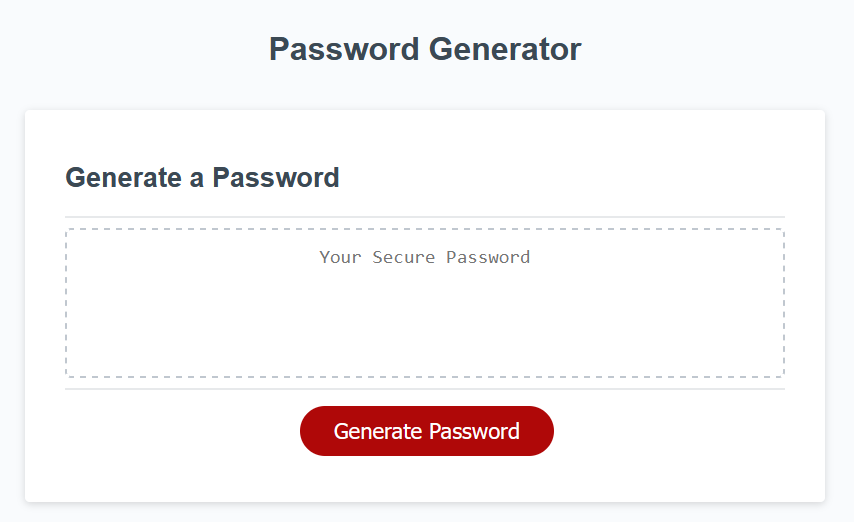
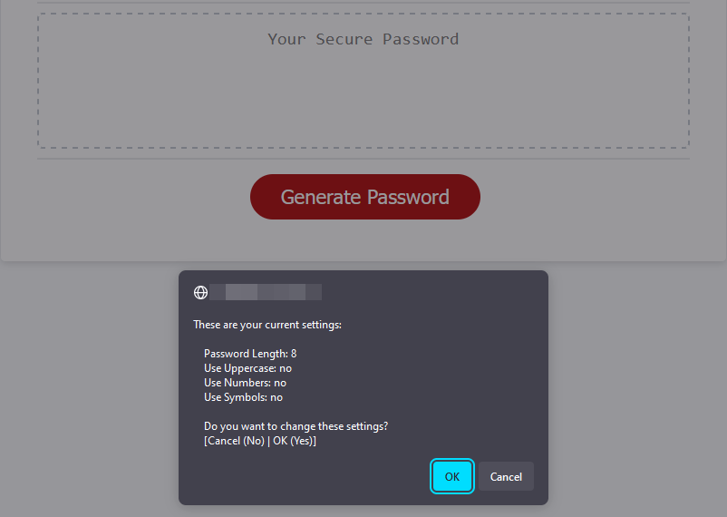

# Not-Bitwarden - A simple password generator
## Description
This is a coding challenge submission for the University of Sydney coding bootcamp, wherein we were tasked with creating the functionality of a password generator using JavaScript. HTML and CSS files were pre-supplied for this challenge.

The app supports multiple options for generation, including the use of uppercase, numerical, or symbol keys. It should be noted that the character set for the special characters were intentionally limited to a small pre-selection to improve general odds of being accepted by most websites when used.

Some of the skills that were employed in the process of creating this app include, but aren't limited to:
- Creation of Classes (Setting class)
- Incorporation of static methods and properties
- Selection of ASCII characters through the use of Code Points
- Creating internal helper functions through Arrow Functions

## Preview

 

## Usage
To start using the app, click the "Generate Password" button, you'll be given a series of prompts
- The option to run generation with defaults (or last used settings if you're reusing it)
- The password length
  - Please note if you try to change the length to something too low, or an invalid value, it will revert to the minimum length. Large numbers will be capped to the maximum.
- If you wish to use
  - Uppercase Characters (ABC)
  - Numbers (123), and/or
  - Symbols (!@#$%^&*)

Once settings are accepted, it will generate a password of the specified length, incorporating at least one of every type of character you opted in to using.

You can run this repeatedly to make new passwords. Please note that it does not keep a record of your previous password generations, so make sure to record any you like.

## Testing
- Try cancelling when asked if you want to set up the values
  - Expected outcome: Generate an 8-digit password using only lowercase characters, per defaults
- Try setting a digit count to 0, or to a non-numerical value such as "twenty"
  - Expected outcome: Defaults to generating a minimum-length password (after completing remaining steps)
- Try setting a digit count to 9000, or similar high value number
  - Expected outcome: Defaults to generating a maximum-length password (after completing remaining steps)
- Try generating a password with capital letters enabled
  - Expected outcome: The password should contain at least one upper case character
- Try generating a password with numbers enabled
  - Expected outcome: The password should contain at least one number
- Try generating a password with symbols enabled
  - Expected outcome: The password should contain at least one symbol
- Try generating a minimum-length password with all options enabled
  - Expected outcome: The password generated should be guaranteed to have at least one of every character type

## Credits

## License
This project is licensed under the [MIT License](./LICENSE).